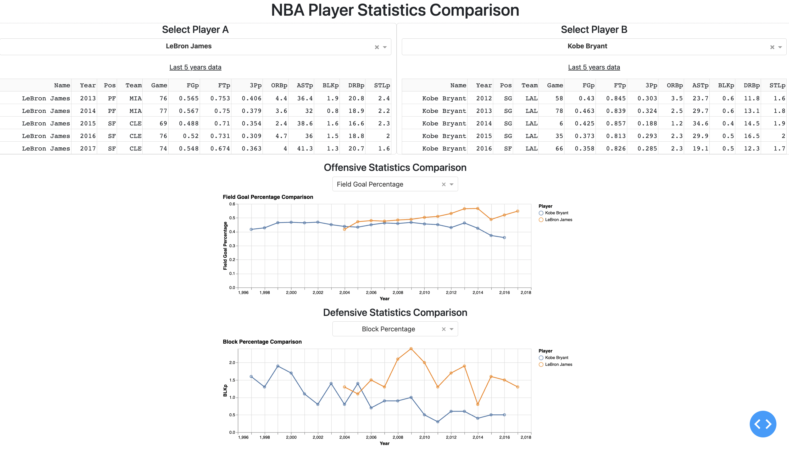

# NBA Player Comparison

The NBA Player Comparison dashboard can be accessed [here](https://cchchechen.shinyapps.io/NBA_Player_Stats/)


## Welcome!

Welcome to the `NBA Player Comparison` app  :confetti_ball:  ！

Thank you for visiting my project and hope all of you can enjoy browsing the NBA player performance.

This document provides statistics comparison of NBA Player Players form 1950 till 2017. Please feel free to navigate each section by the list below: 

* [What are we doing?](#what-are-we-doing)
* [Description of App](#description-of-app)
* [Sketch](#sketch)
* [Contributors](#contributors)
* [How can you get involved?](#get-involved)

## What are we doing?

### The problem

How can we compare different key abilities of each NBA players?

### The solution

The `NBA Player Comparison` app will:

* Help comparing NBA player skills between players
* Help NBA fans better understand their favorite players and visualize the players performances in each categories such as offensive skills and defensive skills.

The most important thing is that we can honor and learn those former NBA superstars, such as Micheal Jordan and Kobe Bryant, by visualizing their performances.

## Description of App

The `NBA Player Comparison` app contains a landing page that shows NBA player skills in multiple categories. The visualization comprises the data of over xx NBA players among 30 NBA teams from 1950-2017. This app aims to help enthusiast NBA fans compare and understand abilities of players. 

The visualization is designed to display multiple statistics of NBA players. The app allows users to search for a pair of interested NBA players by name with a search box item, the app then shows the corresponding player's information. Furthermore. the users are able to select both offensive skills and defensive skills to compare. The app provides functionalities as,

- Player name search bar to choose a pair of players to compare.

- Statistics of the last 5 years of selected players.

- A check box to choose an offensive skill to compare such as `Field Goal Percentage(FGp)`, `Free Throw Percentage(FTp)`, `3-Point Percentage(3Pp)`, `Offensive Rebound Percentage(ORBp)`, `Assist Percentage(ASTp)`.

- A check box to choose a defensive skill to compare such as `Block Percentage(BLKp)`, `Defensive Rebound Percentage(DRBp)`, `Steal Percentage(STLp)`.

We provides two charts to visualize and compare the players' skills.

Therefore, users can compare each NBA player's performance in detail and understand more about the player they are interested in.


## Sketch


## Contributors
The contributors of this project is Nate Puangpanbut.

## Usage

To install `nba_player_comparison` locally, you can:

1. Clone this repository with:

```
git clone https://github.com/Suraporn/nba_player_comparison.git
```

2. xxx

3. xxx

## Get involved 

If you have any new ideas and suggestions for improvement about this app, please feel free to contact us. The main contact email is: suraporn83@gmail.com

Please note that it's very important to us that we maintain a positive and supportive environment for everyone who wants to participate. You can check the code of conduct for more details if you want to be with us.

# License
`nba_player_comparison` is licensed under the terms of the MIT license.
Please refer to the License File [here](https://github.com/Suraporn/nba_player_comparison/blob/main/LICENSE)
